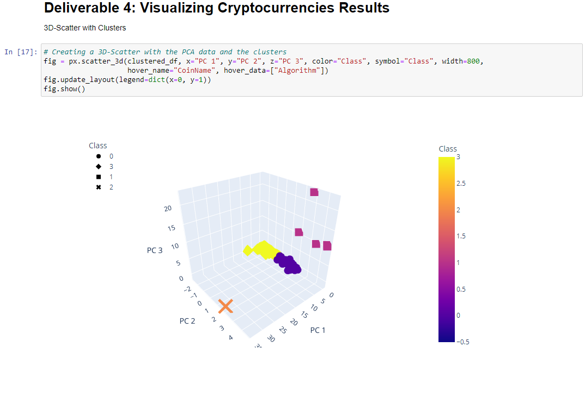

# Cryptocurrencies

## Purpose: 
Using unsupervised learning to process data, clustering, reducing dimensions, and reducing the principal components using PCA to create an analysis for prospective ccryptocurrency investors.

## Resources
- Jupyter Lab
- Python 3.7
- scikit-learn 0.24
- hvPlot 0.7.0
- Plotly 4.14.3

## Results

## Summary
We identified the classification of 531 cryptocurrencies based on similarities of their features. The next step would be to test an unsupervised learning and clustering algorithms to group the currencies.